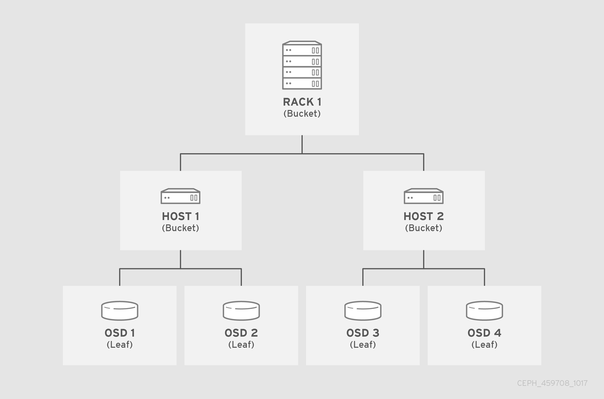

#### [CEPH STORAGE STRATEGIES GUIDE](https://access.redhat.com/documentation/en-us/red_hat_ceph_storage/4/html/storage_strategies_guide/index)

##### The CRUSH map for your storage cluster describes your device locations within CRUSH hierarchies and a rule for each hierarchy that determines how Ceph stores data.

##### The CRUSH map contains at least one hierarchy of nodes and leaves. The nodes of a hierarchy, called "buckets" in Ceph, are any aggregation of storage locations as defined by their type. For example, rows, racks, chassis, hosts, and devices. 

##### OSD is considered as leaf where the objects live. 




<br>


##### A failure domain dictates the object placement. For example,if the failure domain is set rack level, ceph would make sure that the replicated blocks are placed in a different racks. This ensure data survival in the event of whole rach failure.<br>


```bash
## list the class crush, 
ceph osd crush tree


1       0.58398 root default  ## there is the default hierarchy. Each hierarchy starts with root bucket.  
-4       0.58398     host k8-2  ## host is always added as default bucket       
 0 hdd 0.48729         osd.0    ## osd are listed under the host and ceph gives a device-class based on the storage
 1 ssd 0.09669         osd.1    ## type, such as hdd, ssd or nvme


```
